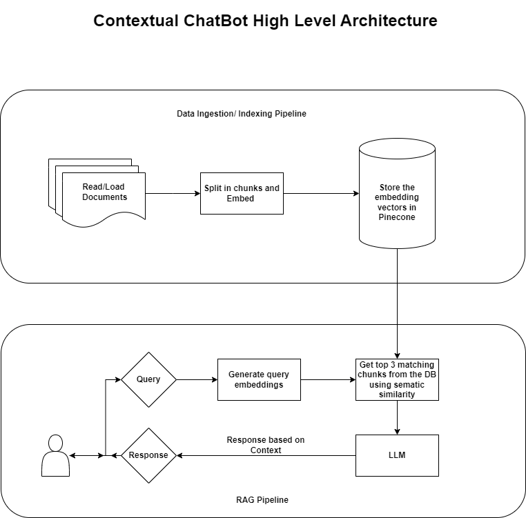
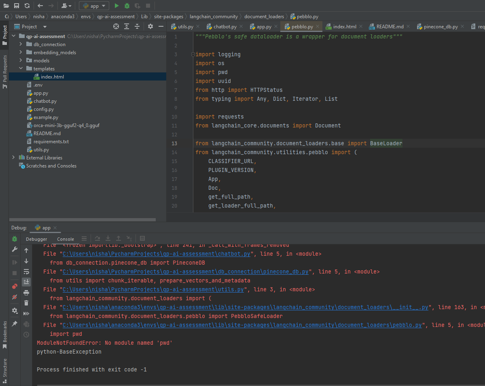
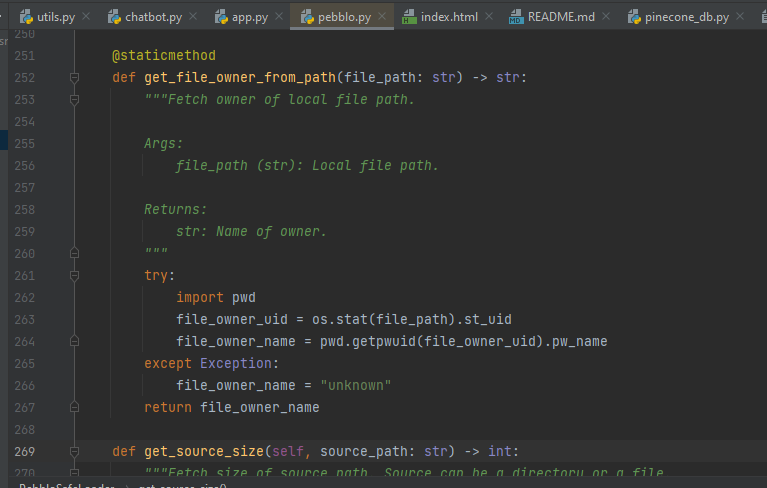

## Problem Statement:
Presentation on a versatile, intelligent chatbot that utilizes a Retrieval-Augmented Generation (RAG) system enhanced with a Chain of Thought (CoT) strategy. This chatbot will be integrated into various WordPress blogs and sites, designed to handle and adapt to a wide range of topics, maintaining logical and contextually relevant interactions.

## Hardware Requirements

### CPU
- **Type:** Modern multi-core processor (e.g., Intel i7/i9, AMD Ryzen 7/9)
- **Cores:** At least 12 physical cores (24 threads)
- **Clock Speed:** 2.7 GHz or higher

### GPU (Recommended)
- **Memory:** Minimum of 12 GB VRAM,  recommended 24 GB
- **Type:** NVIDIA RTX 2080 Ti or higher (e.g., RTX 3090, RTX A6000)
- **CUDA Cores:** Preferably 3584 cores or more
- **CUDA Capability:** Ensure the GPU supports CUDA 11.x or higher

### RAM
- **Minimum:** 32 GB
- **Recommended:** 64 GB or more

### Storage
- **Type:** SSD (Solid State Drive)
- **Capacity:** At least 100 GB free space

### Operating System
- **Linux (Ubuntu 18.04/20.04 or later)**
- **Windows 10/11**
- **macOS (for development and small-scale inference)**

### Other Requirements
- **Python Environment:** Python 3.8 or later
- **Dependencies:** PyTorch, transformers, and other necessary libraries
- **Internet Connection:** For downloading the model and dependencies

Simple Contextual Chat Bot
1. Read a long PDF/ Word Document. 
2. Build a chat bot that will use the document as a context to answer the question. 
3. If the answer is not found in the document - it should say I don't know the answer. 

Advanced Challenge:
- Break down the document into multiple chunks/ paragraphs. 
- Store them in a vector database like pinecone.  
- When you ask a question find out the top 3 chunks that will likely have the answer to the question using semantic similarity search. 

This repo is the implementation of the given problem statement using a RAG system. 
## High-level architecture of the implementation

Two different LLM models have been used for the purpose of the implementation.
1. gpt-3.5-turbo
2. llama-2-7b-chat.ggmlv3.q4_1.bin (You need to download this model from the following [link](https://huggingface.co/TheBloke/Llama-2-7B-Chat-GGML/tree/main) 
and place it in the "llms" directory of this repo).

## Steps for running this repo:
1. Get OPENAI_API_KEY, PINECONE_API_KEY and HUGGINGFACEHUB_API_TOKEN from respective websites and paste it in .env file.**Note-In order to do inferencing through "gpt-3.5-turbo" it is expected that there must be some balance in you OpenAI account as 
it is a paid service. You can add some minimal amount of money as it costs very less amount of money for this model.**
2. Create virtual environment. 
3. Install requirements using

``pip install -r requirements.txt``

4. After installing everything from the requirements you also need to install below lib

``pip install unstructured[local-inference]``

## NOTE:-
1. In you are running this repo on windows 10, then you might encounter following error

2. In order to resolve this error, in pebblo.py shift the "import pwd" to line no. 262 inside try block.
Now run flask app using command 

``python -m flask run``

It is recommended to use **gpt-3.5-turbo** model as it is giving correct results while inferencing. 
The case with **llama-2-7b-q4** is however not the same as many times it is noticed that it doesn't output the 
correct results. And also it was noticed that it is not following the instructions properly. Sometimes you have 
to query same question again and again to get the correct answer from llama-2. 
Maybe llama-2-13b can be better choice than this one or can also try with 8-bit quantised on 7b. 
The purpose of choosing the llama-2-7b-q4 was to run this locally on my PC and 
as per my PC's configuration this 4-bit-quantised model was the best fit in terms of max RAM usage.

## Next Steps
As per the requirements all the points have been implemented and one can test it from their end. Now for the next steps
here are few points that can be implemented:
1. Add ReRanker to rerank top 3 results fetched from the db, as it is not always the case that correct answer is in the first chunk.
2. Build a RAG evaluation pipeline
3. Implement RAG pipeline with other open-source LLMs like(llama-2-13B, Mistral 7B, falcon)
4. Fine tuning LLM model

## More Documentation

https://www.canva.com/design/DAGI-nllJX8/mc_2V3NTw3g0jGVI0cCGLw/edit?utm_content=DAGI-nllJX8&utm_campaign=designshare&utm_medium=link2&utm_source=sharebutton 
